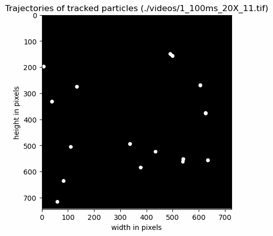

# Particle Tracking (Python)

[](https://forthebadge.com) [](https://forthebadge.com)

This small script can track the Brownian motion of particles in black and white videos and calculate the trajectories of the particles. It also calculates the mean squared displacement (MSD) of the particles and approximates the radius.




<p align="center">
  <a href="#🎨 Features">Features</a> •
  <a href="#⚙️ Installation">Installation</a> •
  <a href="#🧪 Usage">Usage</a> •
  <a href="#💬 Contributing">How to Contribute</a> •
  <a href="#📄 License">License</a> •
  <a href="#🤝 Acknowledgements">Acknowledgements</a>
</p>

## About

This script was developed for a lecture at the [Université de Bordeaux](https://www.u-bordeaux.fr). It was written quickly and the algorithm is not optimal, but it does its job. It will analyze a video sequence of one minute containing 13 particles in ~4 seconds.

### 🎨 Features

- Tracking the Brownian motion of particles in black and white videos.

- Plotting the trajectory, and animating the trajectory over time.

- Calculating the mean squared displacement (MSD) of the particles and plotting the results over time.

- Calculating of the particle radius using the Stokes-Einstein equation.

- Approximating Avogadro's Number using the particles radii.

### ⚠️ Current Limitations

The script still has the following limitations. However, these can be addressed and easily implemented in the future.

- The videos must be black and white with the particles highlighted in white. 

- Due to the detection mechanism, overlapping particles can only be detected as one particle and not as independent particles.

- The particles are tracked starting from the first frame of the video. Any particle that moves into the image during the video is currently not tracked. 

- The script can only handle one particle type. It cannot calculate the radii for multiple particles because it averages over all particles.

## ⚙️ Installation

To start using the particle tracking, follow these installation steps:

1. Clone the repository:

   ```bash
   git clone https://github.com/karlgrossmann/particle-tracking-py.git
   ```

2. Navigate to the project directory:

   ```bash
   cd particle-tracking-py
   ```

3. Install the required dependencies:

   ```bash
   pip install -r requirements.txt
   ```

Done. Now you can already start using the tracking algorithm. 🎉

## 🧪 Usage

The script can be used by only calling the Python files in the command line with all the necessary flags. To calculate the trajectories, MSD and radii of the particles, use the following command:

``` 
python main.py -p [path] -f [FPS] -r [ratio] -t [temperature] -v [viscosity] 
```

In order to animate the trajectories of the particles as a gif, use the following command:

``` 
python animate_trajectories.py -p [path] -b 
```

Below there is a listing of all possible flags and their explanations.

To analyse the example video included in this repository the calls look like this:

``` 
python main.py -p "./example/brownian_motion_example.tif" -f 10 -r 0.32 -t 25 -v 0.89 -s
python animate_trajectories.py -p "./example/brownian_motion_example.tif" -b
```

### 🚩 Flags

For the **main script** calculating the trajectories, MSD and radius of the particles there are the following flags:

- `-p [string] / --path [string]`: Set the relative path of the video file you want to analyse. The video has to be in the format TIF, which should be a standard output when recording the pictures of a microscope.
- `-f [int] / --framerate [int]`: Set the framerate of the video you want to analyse. Important to calculate the MSD correctly.
- `-r [float] / --ratio [float]`: Set the ratio of pixels to micrometer by 1 px = [ratio] micrometer. Used to calculate the MSD and radius.
- `-t [int] / --temperature [int]`: Set the temperature at which the particles were recorded in the video (as °C). Used to calculate the radii of the particles.
- `-v [float] / --dynamic_viscosity [float]`: Set the dynamic viscosity of the fluid the particles were in (as mPa⋅s). Used to calculate the radii of the particles.
- `-m [int] / --max_distance [int] (optional)`: Set the maximal movement distance of particles in pixels. Used to check if a particle moved out of the image. If not set the standard value of 50 is used.
- `-s / --save_plots (optional)`: Using this option saves all plots automatically instead of showing them.

In order to **animate the trajectories** the following flags are available:

- `-p [string] / --path [string]`: Set the relative path of the video file you want to plot and animate the trajectories for.
- `-m [int] / --max_distance [int] (optional)`: Set the maximal movement distance of particles in pixels. Used to check if a particle moved out of the image. If not set the standard value of 50 is used.
- `-b / --enable-background (optional)`: Use this flag to use the original video as background for the animated plot.
- `-f [str] / --output_filename [str] (optional)`: Set the filename of the resulting output file. 

## 💬 Contributing

If you found a bug or this script is not working with your files, please open a new issue and make sure to use the label `bug` for it when creating the issue. Please document your issue well.

If you want to fix a bug or have a suggestion that would make this script better and you want to contribute it yourself, please open a new GitHub pull request with your changes. Any contribution to this repository is greatly appreciated.

If you just have questions concerning the code or how it works, just open a issue with the label `question`.

## 📄 License

The source code in this repository is licensed under the [MIT License](LICENSE.md) - see the LICENSE file for details.

## 🤝 Acknowledgements

Thanks to the team of [scikit-image](https://scikit-image.org) to make a fast tracking of white regions possible using their `regionsprops` function. 
